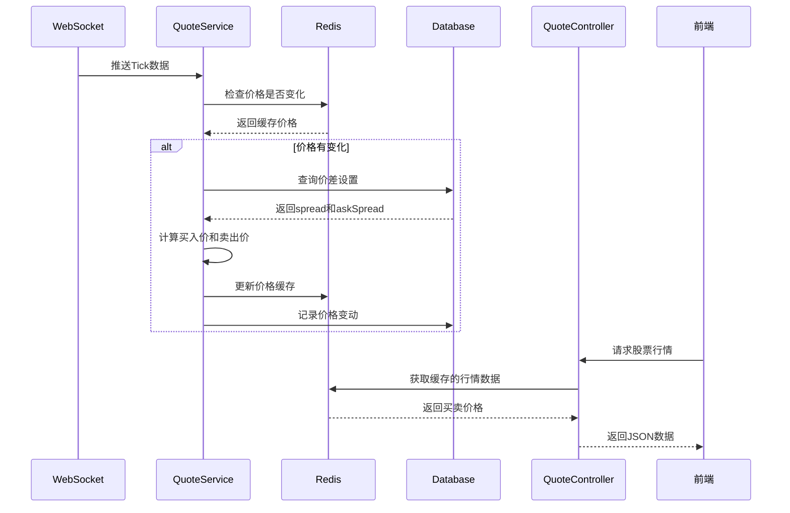

# 实时股票行情数据系统

## 需求背景

用户需要实现一个高性能的实时股票行情数据系统，能够：
1. 通过WebSocket订阅5只指定美股（NVDA.US, MSFT.US, AAPL.US, AMZN.US, GOOG.US）的实时价格数据
2. 智能过滤重复数据，只在价格真正变化时记录TICK数据
3. 为前端提供高频访问接口，每秒返回包含买卖价格的股票信息
4. 买入价=实时价格+买入价差，卖出价=实时价格-卖出价差
5. 价差数据从trading_settings表获取（spread字段为买入价差，askSpread字段为卖出价差）

## 用户故事

作为交易系统的前端开发者，我需要：
- 能够每秒获取到5只美股的最新买卖价格
- 获得的价格数据要准确反映实时市场变化
- 系统性能要足够高，能够处理高频数据更新
- 价格计算要基于实时的价差设置

## 使用场景

1. **数据订阅场景**：系统启动后自动连接WebSocket，订阅5只美股的实时行情
2. **数据过滤场景**：每秒收到WebSocket推送，但只有价格变化时才触发数据处理
3. **缓存更新场景**：新的TICK数据到达时，更新Redis中的股票价格缓存
4. **API访问场景**：前端每秒调用接口获取最新的买卖价格信息

## 技术方案

### 1. 系统架构设计

```
WebSocket数据源 → QuoteService → Redis缓存 → QuoteController → 前端
                      ↓
              数据去重与过滤
                      ↓
              价差计算与缓存更新
```

### 2. 数据库表结构设计

#### 2.1 股票实时价格表 (stock_realtime_price)
```sql
CREATE TABLE stock_realtime_price (
  id BIGINT PRIMARY KEY AUTO_INCREMENT,
  code VARCHAR(20) NOT NULL COMMENT '股票代码',
  price DECIMAL(18,6) NOT NULL COMMENT '实时价格',
  volume BIGINT DEFAULT 0 COMMENT '成交量',
  turnover DECIMAL(20,2) DEFAULT 0 COMMENT '成交额',
  tick_time TIMESTAMP(3) NOT NULL COMMENT 'tick时间戳',
  created_at TIMESTAMP DEFAULT CURRENT_TIMESTAMP,
  updated_at TIMESTAMP DEFAULT CURRENT_TIMESTAMP ON UPDATE CURRENT_TIMESTAMP,
  UNIQUE KEY uk_code_tick_time (code, tick_time),
  KEY idx_code_created (code, created_at),
  KEY idx_created_at (created_at)
) ENGINE=InnoDB DEFAULT CHARSET=utf8mb4 COMMENT='股票实时价格表';
```

#### 2.2 股票价格变动记录表 (stock_price_change)
```sql
CREATE TABLE stock_price_change (
  id BIGINT PRIMARY KEY AUTO_INCREMENT,
  code VARCHAR(20) NOT NULL COMMENT '股票代码',
  old_price DECIMAL(18,6) NOT NULL COMMENT '变化前价格',
  new_price DECIMAL(18,6) NOT NULL COMMENT '变化后价格',
  price_change DECIMAL(18,6) NOT NULL COMMENT '价格变动',
  change_rate DECIMAL(10,6) NOT NULL COMMENT '变动率',
  volume BIGINT DEFAULT 0 COMMENT '成交量',
  tick_time TIMESTAMP(3) NOT NULL COMMENT 'tick时间戳',
  created_at TIMESTAMP DEFAULT CURRENT_TIMESTAMP,
  KEY idx_code_created (code, created_at),
  KEY idx_created_at (created_at)
) ENGINE=InnoDB DEFAULT CHARSET=utf8mb4 COMMENT='股票价格变动记录表';
```

### 3. Redis缓存设计

#### 3.1 缓存键设计
- 股票实时价格：`stock:price:{code}` (TTL: 60秒)
- 股票买卖价格：`stock:quote:{code}` (TTL: 5秒)
- 价差设置：`stock:spread:{code}` (TTL: 300秒)
- 所有股票汇总：`stock:quotes:all` (TTL: 2秒)

#### 3.2 数据结构
```json
// stock:quote:{code}
{
  "code": "NVDA.US",
  "realtime_price": 145.67,
  "buy_price": 145.87,
  "sale_price": 145.47,
  "spread": 0.20,
  "askSpread": 0.20,
  "volume": 1000000,
  "tick_time": "2024-01-01T10:30:00.123Z",
  "updated_at": "2024-01-01T10:30:00.123Z"
}

// stock:quotes:all
{
  "codeList": [
    {
      "code": "NVDA.US",
      "buy_price": 145.87,
      "sale_price": 145.47
    },
    // ... 其他4只股票
  ],
  "updated_at": "2024-01-01T10:30:00.123Z"
}
```

### 4. 实现细节

#### 4.1 数据实体设计
```typescript
// 股票实时价格实体
@Entity('stock_realtime_price')
export class StockRealtimePriceEntity {
  @PrimaryGeneratedColumn()
  id: number;

  @Column({ type: 'varchar', length: 20 })
  code: string;

  @Column({ type: 'decimal', precision: 18, scale: 6 })
  price: number;

  @Column({ type: 'bigint', default: 0 })
  volume: number;

  @Column({ type: 'decimal', precision: 20, scale: 2, default: 0 })
  turnover: number;

  @Column({ type: 'timestamp' })
  tick_time: Date;

  @CreateDateColumn()
  createdAt: Date;

  @UpdateDateColumn()
  updatedAt: Date;
}

// 股票价格变动实体
@Entity('stock_price_change')
export class StockPriceChangeEntity {
  @PrimaryGeneratedColumn()
  id: number;

  @Column({ type: 'varchar', length: 20 })
  code: string;

  @Column({ type: 'decimal', precision: 18, scale: 6 })
  old_price: number;

  @Column({ type: 'decimal', precision: 18, scale: 6 })
  new_price: number;

  @Column({ type: 'decimal', precision: 18, scale: 6 })
  price_change: number;

  @Column({ type: 'decimal', precision: 10, scale: 6 })
  change_rate: number;

  @Column({ type: 'bigint', default: 0 })
  volume: number;

  @Column({ type: 'timestamp' })
  tick_time: Date;

  @CreateDateColumn()
  createdAt: Date;
}
```

#### 4.2 数据流设计
1. **WebSocket数据接收**：QuoteService接收实时Tick数据
2. **价格变化检测**：比较当前价格与缓存中的价格
3. **数据去重**：使用Redis记录最近收到的价格，避免重复处理
4. **价差查询**：从trading_settings表获取对应股票的价差设置
5. **价格计算**：计算买入价和卖出价
6. **缓存更新**：更新Redis中的股票价格信息
7. **数据库记录**：异步保存价格变动记录到数据库

#### 4.3 逻辑时序设计


#### 4.4 接口设计
```typescript
// 获取所有股票行情接口
GET /api/quote/realtime
Response: {
  "codeList": [
    {
      "code": "NVDA.US",
      "buy_price": 145.87,
      "sale_price": 145.47
    }
    // ... 其他4只股票
  ]
}

// 获取指定股票行情接口
GET /api/quote/realtime/:code
Response: {
  "code": "NVDA.US",
  "buy_price": 145.87,
  "sale_price": 145.47
}
```

### 5. 性能优化策略

#### 5.1 数据库优化
- 使用复合索引优化查询性能
- 采用分表策略存储历史数据
- 使用连接池管理数据库连接
- 异步写入减少响应时间

#### 5.2 Redis优化
- 使用Pipeline批量操作减少网络开销
- 合理设置TTL避免内存溢出
- 使用Hash结构存储多字段数据
- 定期清理过期数据

#### 5.3 应用层优化
- 内存缓存热点数据
- 使用事件驱动架构
- 批量处理数据库操作
- 连接池管理外部资源

## 预期成果

1. **高性能系统**：能够处理每秒5次以上的价格更新，API响应时间<50ms
2. **数据准确性**：确保价格计算的准确性，买卖价差实时更新
3. **系统稳定性**：7x24小时稳定运行，支持自动重连和故障恢复
4. **可扩展性**：支持后续添加更多股票和功能扩展
5. **监控完善**：提供完整的系统监控和日志记录

## 技术栈

- **后端框架**：NestJS + TypeScript
- **数据库**：MySQL 8.0
- **缓存**：Redis 6.0+
- **WebSocket**：ws库
- **ORM**：TypeORM
- **API文档**：Swagger
- **监控**：Winston日志
